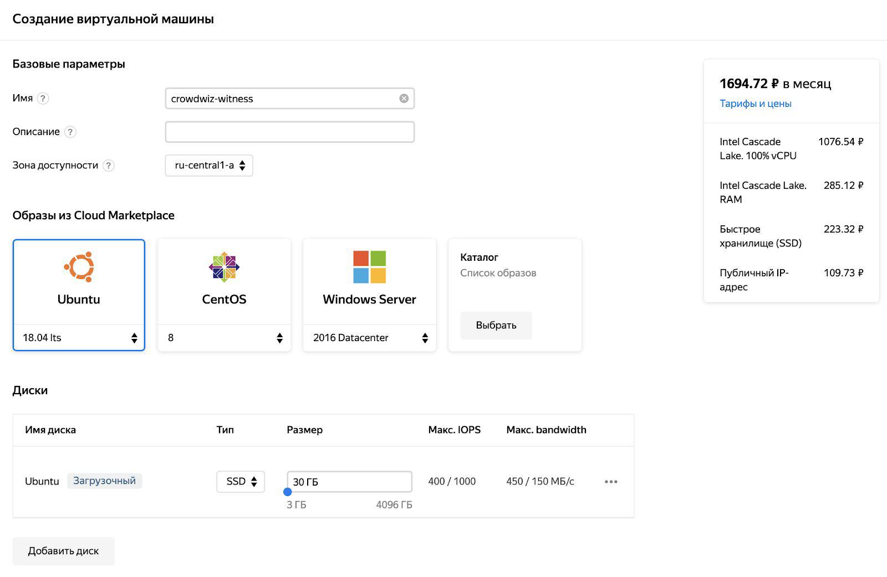

# Хостинг Witness

Теперь нужно определиться с хостингом для витнеса, вы можете разместить витнес на каком-нибудь хостинге, поддерживающем тип хостинга VPS, при этом минимальная конфигурация вашего виртуального сервера должна быть следующей:

* 1 процессор, но чем мощнее тем лучше
* 8 ГБ оперативной памяти (+8 GB SWAP для сборки проекта)
* 30 ГБ свободного места на HDD/SSD
* Операционная системы Ubuntu 18.04 LTS
* Выделенный IP-адрес для удобного управления сервером

_В отличии от seed или api узла, Block-production node может работать за NATом, то есть ему не нужен внешний IP адрес. Достаточно постоянного доступа к сети интернет, так что, в принципе, можно разместить витнес на домашнем компьютере, при условии что он будет работать 24х7 (но в данной инструкции случай с домашним сервером мы рассматривать не будем)._

Дальше мы для примера рассмотрим создание VPS у двух популярных провайдеров, если вы живёте не в России, то лучше выбирать Digitalocean, а если в России, то Яндекс.

### Digitalocean.com (DO)

У него есть проблема с IP-адресами - они часто попадают в блеклист Роскомнадзора, поэтому может понадобиться создавать и удалять VPS (в терминах DO они называются Droplets) до тех пор, пока вы не сможете на него зайти. Но во всём остальном это один из лучших провайдеров с достойной ценой и высокой надёжностью. Просто зарегистрируйтесь и привяжите карту или PayPal. Новым пользователям обычно предоставляется пробный период.

Ссылка: [https://www.digitalocean.com/](https://www.digitalocean.com/)

#### Настройка виртуального сервера DO

После регистрации и активации карты или аккаунта PayPal необходимо нажать зелёную кнопку Create (в верхнем правом углу), и в выпадающем списке выбрать Droplets.

<figure><figcaption></figcaption></figure>

Затем во вкладке Distributions нужно выбрать Ubuntu 18.04.3 (LTS) x64, на вкладке Choose a plan выбрать Standart и выбрать конфигурацию: $40/mo (8GB/4CPU)

<figure><figcaption></figcaption></figure>

Далее в разделе Choose a datacenter region выбираем физический дата-центр, где будет работать наш сервер, рекомендуем выбирать Американские или Европейские дата-центры.

<figure><figcaption></figcaption></figure>

Раздел VPC Network оставляем No VPC Network и Select Additional options также оставляем пустым.

<figure><figcaption></figcaption></figure>

Следующий важный раздел - Authentication здесь мы должны добавить наш публичный ssh-ключ, сгенерированный на этапе Настройка SSH. Для этого нужно нажать кнопку New SSH Key.

<figure><figcaption></figcaption></figure>

В появившемся окне вставляем наш публичный ключ и придумываем для него имя.

<figure><figcaption></figcaption></figure>

Затем выбираем его из списка:

<figure><figcaption></figcaption></figure>

После этого нужно указать имя виртуального сервера, а остальные параметры оставить по умолчанию и нажать кнопку "Create Droplet"

<figure><figcaption></figcaption></figure>

Вы автоматически перейдёте на главный экран, где будет показан прогресс создания вашего виртуального сервера

<figure><figcaption></figcaption></figure>

Когда создание сервера будет завершено, то вы увидите его IP адрес:

<figure><figcaption></figcaption></figure>

В нашем примере это 128.199.63.75

Теперь можно попробовать присоединиться к этому серверу через SSH В MacOs нужно зайти в LaunchPad, зайти в папку Другие и запустить оттуда программу Терминал, в Linux просто запустите любимый терминал, а затем выполните команду: `ssh root@128.199.63.75` **ВАЖНО! Необходимо использовать IP-адрес вашего сервера!**

Если всё ок, то вы увидите примерно такое сообщение:

<figure><figcaption></figcaption></figure>

Здесь нужно ввести с клавиатуры yes и нажать enter После этого вы увидите перед собой строку терминала вашего будущего витнеса. `root@crowdwiz-witness:~ #` Что в ней писать мы разберёмся далее. Чтобы завершить сессию, вы можете написать в терминале команду exit или просто закрыть терминал.

### Облако Яндекс

Если у вас уже есть аккаунт яндекса с привязанным к нему мобильным телефоном, то вы просто переходите на странцу [https://console.cloud.yandex.ru/](https://console.cloud.yandex.ru/) и нажимаете кнопку Войти, затем кнопку Активировать пробный период. Если нет аккаунта, то создайте аккаунт на Яндексе. Вам будет предложено создать платёжный аккаунт. Создайте его и привяжите карту.

#### Настройка виртуального сервера Яндекс

После того как вы активировали свою учётную запись, вы попадаете на главный экран консоли управления Яндекс.Облака. Для начала нам понадобится статический IP-адрес, для этого нужно перейти в главном меню в раздел Virtual Private Cloud

<figure><figcaption></figcaption></figure>

Затем перейти в меню IP адреса и нажать кнопку Зарезервировать адрес

<figure><figcaption></figcaption></figure>

Можно оставить все поля по умолчанию и нажать кнопку "Зарезервировать"

<figure><figcaption></figcaption></figure>

Через несколько секунд на основной странице IP-адресов появится ваша резервация

<figure><figcaption></figcaption></figure>

Теперь можно переходить непосредственно к настройке самого сервера. Для этого нужно снова перейти в главное меню [https://console.cloud.yandex.ru/](https://console.cloud.yandex.ru/) и выбрать раздел "Compute Cloud"

<figure><figcaption></figcaption></figure>

Затем нужно нажать кнопку Создать ВМ

<figure><figcaption></figcaption></figure>

Здесь будет нужно заполнить имя машины - например, crowdwiz-witness, выбрать операционную систему Ubuntu 18.04 LTS, выбрать тип диска SSD и размер диска 30 GB

<figure><figcaption></figcaption></figure>

Ниже нужно заполнить раздел Вычислительные ресурсы: Указываем процессор Intel Cascade Lake, 2 потока (vCPU), 100% доля использования, 8 GB оперативной памяти. Затем указываем зарезервированный на предыдущем шаге IP-адрес (Публичный адрес - Список), пишем системный логин ( например, witness), затем указываем свой публичный ssh-ключ, ставим галочку Разрешить доступ к серийной консоли и нажимаем кнопку Создать ВМ

<figure><figcaption></figcaption></figure>

После этого вы увидите в списке виртуальных машин новую строчку с виртуальной машиной в статусе Provisioning

<figure><figcaption></figcaption></figure>

Нужно дождаться когда статус машины сменится на Running

<figure><figcaption></figcaption></figure>

Теперь можно подключиться к нашему удалённому серверу по SSH, для этого в MacOs нужно зайти в LaunchPad, зайти в папку Другие и запустить оттуда программу Терминал, в Linux просто запустите любимый терминал, а затем (заменив IP-адрес из примера 84.201.129.123 на свой) выполните команду : `ssh witness@84.201.129.123` Если всё ок, то вы увидите примерно такое сообщение:

<figure><figcaption></figcaption></figure>

Здесь нужно ввести с клавиатуры yes и нажать enter После этого вы увидите перед собой строку терминала вашего будущего витнеса.

<figure><figcaption></figcaption></figure>
